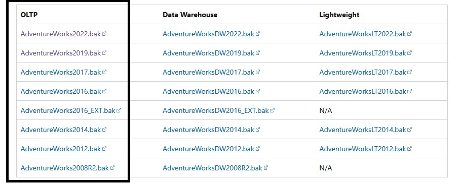
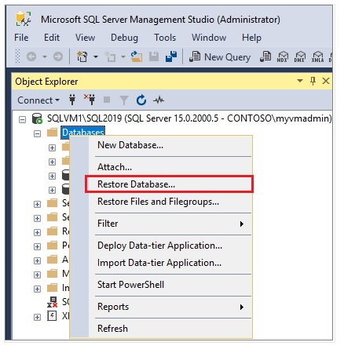

# Setting Up SQL Server and Database

This guide provides step-by-step instructions for installing and working with **Microsoft SQL Server**.

---

## 📌 Download Required Files

### 1️⃣ Install SQL Server Developer Edition  
Choose the version based on your PC specifications:

- **SQL Server 2022 Developer**  
  Follow this guide: [Installing SQL Server 2022 Developer Edition](https://jimsalasek.com/2022/12/06/installing-sql-server-2022-developer-edition/)

- **SQL Server 2019 Developer**  
  Follow this guide: [Installing SQL Server 2019 Developer Edition](https://jimsalasek.com/2019/12/03/installing-sql-server-2019-developer-edition/)

### 2️⃣ Install SQL Server Management Studio (SSMS)  
SSMS works with both SQL Server 2022 and SQL Server 2019.

- **Download and install SSMS**:  
  Follow the official guide: [Installing SQL Server Reporting Services (SSRS) 2022](https://jimsalasek.com/2023/01/04/how-to-install-sql-server-reporting-services-ssrs-2022/)

### 3️⃣ Download Sample Database Backup Files  
Use these links to download the appropriate **sample database** for your scenario:  
    
- **[AdventureWorks2022.bak](https://github.com/Microsoft/sql-server-samples/releases/download/adventureworks/AdventureWorks2022.bak)** → For **OLTP** (Online Transaction Processing), compatible with SQL Server 2022.
- **[AdventureWorks2019.bak](https://github.com/Microsoft/sql-server-samples/releases/download/adventureworks/AdventureWorks2019.bak)** → For **OLTP** (Online Transaction Processing), compatible with SQL Server 2019.

---

## 📌 Restoring a Sample Database  

1. **Open SSMS** and connect to your SQL Server instance.  
2. **Right-click `Databases`** in **Object Explorer** > **Restore Database...** to launch the **Restore Database wizard**.  
     
3. Select **Device** and then click the ellipsis **(...)** to choose a device.  
4. Click **Add**, then **browse** and select the **.bak file** you downloaded.  
5. Click **OK** to confirm your selection and close the **Select backup devices** window.  
6. Check the **Files** tab to confirm that the **Restore As** location and file names match your intended destination.  
7. Click **OK** to **restore your database**.  

---

## 📌 Next Steps  

- After installation, configure your SQL Server following the **Setup Wizard**.  
- Open **SQL Server Management Studio (SSMS)** and connect to your SQL Server instance.  
- Use the **`sql-scripts/`** folder in this repository to create, modify, and query your database.  
- Refer to **[`highlights.md`](highlights.md)** for key SQL topics and ready-to-use queries.  

---

💡 *This guide ensures a smooth setup for SQL Server, SSMS, and sample databases so you can start working efficiently.* 🚀  

### 🔗 Navigation
 Previous: [`ReadME`](../README.md) | Next: [`Introduction to SQL`](Introduction_SQL.md)
